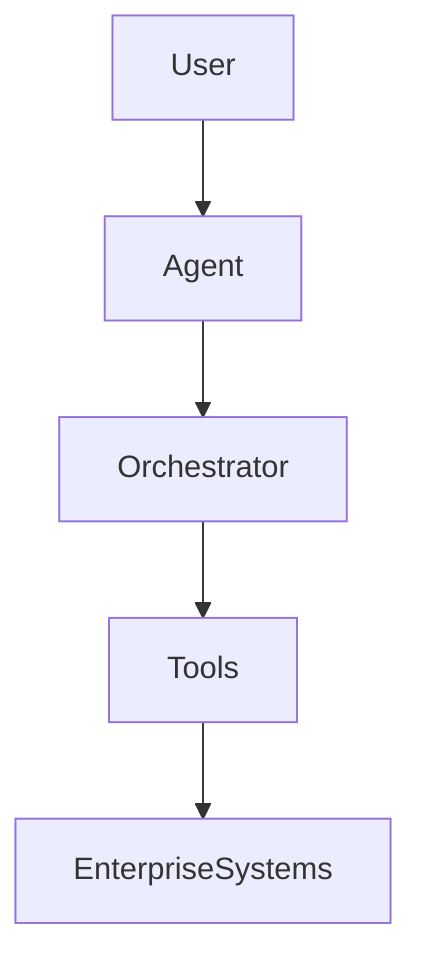

<!-- _class: title -->

# [Presentation Title]

[Subtitle — context, author, date]

---

## Agenda

- Problem framing
- Market and trend context
- Key challenges
- Proposed architecture
- Solution framework
- Deployment options
- Adoption roadmap
- Key takeaways

---

## The Problem We Are Solving

- [Pain point 1 — one line]
- [Pain point 2 — one line]
- [Pain point 3 — one line]
- [Pain point 4 — one line]

> **Bottom line:** [Single sentence that names the core problem]

---

## Market and Trend Context

| Trend | Signal | Implication |
|-------|--------|-------------|
| [Trend 1] | [Evidence] | [What it means] |
| [Trend 2] | [Evidence] | [What it means] |
| [Trend 3] | [Evidence] | [What it means] |

---

## Three Root Challenges

- **[Challenge 1]** — [one-line description]
- **[Challenge 2]** — [one-line description]
- **[Challenge 3]** — [one-line description]

---

## Enterprise AI Agent Architecture

*Replace with your system's component diagram.*

---

## Solution Framework

| Layer | Component | Responsibility |
|-------|-----------|----------------|
| Interface | [Component] | [What it does] |
| Orchestration | [Component] | [What it does] |
| Execution | [Component] | [What it does] |
| Data | [Component] | [What it does] |

---

## Deployment Models

| Model | Advantage | Risk |
|-------|-----------|------|
| SaaS | Fast time-to-value | Data residency |
| Private Cloud | Secure, compliant | Higher cost |
| On-Premises | Full control | Operational burden |

---

## Adoption Roadmap

| Phase | Objective | Duration |
|-------|-----------|----------|
| PoC | Validate core value | 4 weeks |
| Pilot | Integrate key systems | 8 weeks |
| Production | Scale operations | 12 weeks |

---

<!-- _class: title -->

# Key Takeaways

- [Takeaway 1 — most important point]
- [Takeaway 2 — second priority]
- [Takeaway 3 — call to action]

---

<!-- _class: title -->

# Thank You

Questions?  
[Contact / next-step information]
